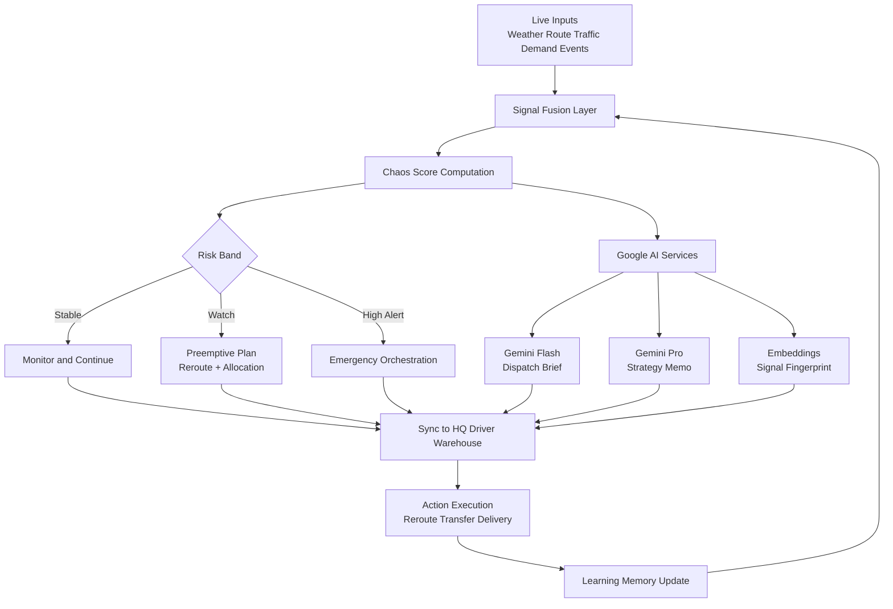
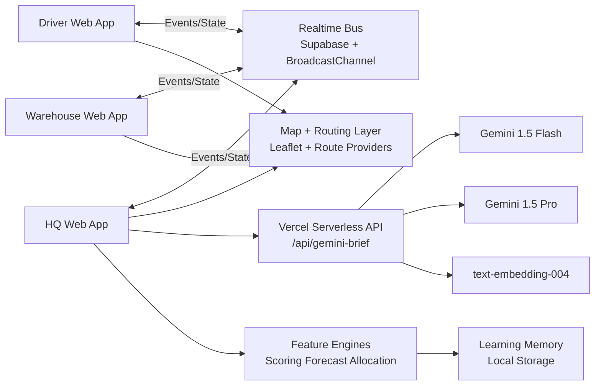

# TezFlow Presentation Content

## 1. Brief About Your Solution
TezFlow is a cloud-deployed, AI-enabled supply chain intelligence platform designed to reduce logistics failures before they escalate.

It continuously monitors weather, route, demand, and operational signals across HQ, warehouse, and driver nodes. Based on these signals, it computes a regional Chaos Score, predicts stress conditions, and recommends fast response actions such as rerouting, stock transfer, and emergency prioritization.

The solution is deployed with static front-end pages and serverless AI endpoints, and includes Google AI services for operational briefing, strategic memo generation, and signal fingerprinting.

## 2. How Different Is It From Existing Ideas?
Most existing logistics dashboards are either:
1. Purely tracking systems (reactive, after the disruption).
2. Planning tools with no live multi-node synchronization.
3. AI demos without real operational integration.

TezFlow is different because it combines:
1. Real-time cross-node event synchronization (HQ, driver, warehouse).
2. Multi-signal fusion into one actionable risk score.
3. Preemptive decisions (not only post-incident reporting).
4. Multi-model Google AI outputs tied to live scenario state.
5. Cloud deployment readiness with fallbacks for resilience.

## 3. How Will It Solve the Problem?
TezFlow solves logistics disruption through early detection and coordinated response:
1. Detect: ingest weather, traffic, demand, and route conditions.
2. Assess: calculate regional risk using Chaos Score and context engines.
3. Explain: generate plain-language AI briefings and strategy notes.
4. Act: trigger reroute, transfer, and emergency response suggestions.
5. Sync: broadcast actions across all operational terminals.
6. Learn: retain lesson patterns to improve future mitigation.

Result: faster response time, fewer cascading failures, better resource utilization, and improved delivery reliability for critical supplies.

## 4. USP of the Proposed Solution
1. Unified Chaos Score for operational clarity.
2. Multi-node synchronized command model (HQ, Warehouse, Driver).
3. Real route intelligence with fallback providers.
4. Three Google AI services integrated in one operational workflow.
5. Hybrid resilience approach: cloud AI plus graceful local fallback.
6. Fast deployment path for hackathon-to-pilot transition.

## 5. List of Features Offered by the Solution
1. Live regional risk scoring (Chaos Score Engine).
2. Self-healing reroute recommendations.
3. Crisis prediction and shortage forecasting.
4. Dynamic allocation guidance for stock transfer.
5. Emergency mode and offline-aware operation.
6. Live weather feed integration.
7. Multi-provider route intelligence and map overlays.
8. Driver congestion and reroute event propagation.
9. Warehouse approval and transfer synchronization.
10. Shared heartbeat across dashboards.
11. Google AI dispatch briefing panel (Gemini Flash).
12. Google AI strategy memo panel (Gemini Pro).
13. Google AI signal fingerprint panel (Embeddings).
14. Vercel cloud deployment with serverless AI endpoint.

## 6. Process Flow Diagram (Mermaid)


## 7. Wireframes / Mock Diagrams (Text Mock)
### 7.1 HQ Dashboard Mock
```text
+--------------------------------------------------------------+
| TezFlow HQ Command Center                                    |
+---------------------+----------------------+-----------------+
| Chaos Score Panel   | Live Route/Weather   | AI Dispatch     |
| Score: 72 (Watch)   | Provider + Pressure  | Gemini Brief    |
+---------------------+----------------------+-----------------+
| Region Heatmap / Map Overlay (Leaflet)                       |
| [Risk circles] [Fleet route] [Congestion zones]              |
+--------------------------------------------------------------+
| AI Strategy Memo (Gemini Pro) | Signal Fingerprint (Embed)   |
+--------------------------------------------------------------+
| Action Controls: Reroute | Approve Transfer | Emergency Mode  |
+--------------------------------------------------------------+
```

### 7.2 Driver Dashboard Mock
```text
+--------------------------------------------------------------+
| Driver Node                                                   |
+---------------------+----------------------+-----------------+
| Route Status        | Incident Feed         | HQ Signal       |
+--------------------------------------------------------------+
| Driver Map (current route + congestion + bypass)             |
+--------------------------------------------------------------+
| Buttons: Report Congestion | Confirm Reroute | Delivery Done  |
+--------------------------------------------------------------+
```

### 7.3 Warehouse Dashboard Mock
```text
+--------------------------------------------------------------+
| Warehouse Node                                                |
+---------------------+----------------------+-----------------+
| Stock Posture       | Incoming Risk         | Transfer Queue  |
+--------------------------------------------------------------+
| Regional map + inbound links + driver overlay                |
+--------------------------------------------------------------+
| Buttons: Approve Transfer | Trigger Crisis Signal            |
+--------------------------------------------------------------+
```

## 8. Architecture Diagram (Mermaid)


## 9. Technologies to Be Used in the Solution
Frontend:
1. HTML5
2. CSS3
3. Vanilla JavaScript
4. Leaflet.js for map visualization

Data and Realtime:
1. Supabase (realtime sync)
2. BroadcastChannel fallback for local sync

AI and Cloud:
1. Google AI (Gemini 1.5 Flash)
2. Google AI (Gemini 1.5 Pro)
3. Google AI Embeddings (text-embedding-004)
4. Vercel Serverless Functions
5. Vercel static hosting

External Intelligence Sources:
1. Open-Meteo weather API
2. OpenRouteService / OSRM / OSMDE routing providers

## 10. Estimated Implementation Cost
### 10.1 Build Cost (Prototype Team)
Assume 3 members for 8 weeks:
1. 1 Frontend Engineer
2. 1 Fullstack/Cloud Engineer
3. 1 AI/Analytics Engineer

Estimated effort: ~960 person-hours total.
If blended rate is 12 to 20 USD/hour, estimated build cost is:
1. Lower estimate: 11,520 USD
2. Upper estimate: 19,200 USD

### 10.2 Monthly Run Cost (Prototype Scale)
Approximate monthly cloud and API cost:
1. Vercel hosting/functions: 0 to 20 USD (hobby/small usage)
2. Supabase: 0 to 25 USD (starter tier)
3. Google AI usage: 10 to 150 USD (depends on requests)
4. Domain and misc ops: 1 to 10 USD

Estimated monthly run range: 11 to 205 USD.

## 11. Additional Details / Future Development
1. Add enterprise traffic and telematics APIs for richer congestion telemetry.
2. Add role-based fine-grained access control and audit workflows.
3. Persist AI recommendations and actions for compliance reporting.
4. Introduce scenario replay and what-if simulation timeline.
5. Add multilingual voice assistant using speech interfaces.
6. Add predictive ETA confidence intervals and SLA breach alarms.
7. Integrate IoT warehouse sensors and cold-chain monitoring.
8. Introduce advanced optimization (capacity-aware multi-objective routing).
9. Build mobile-first field operator apps.
10. Create district/state command hierarchies for national rollout.

## 12. One-Line Pitch
TezFlow is a cloud-native, AI-powered logistics control system that predicts disruption early, synchronizes all operational nodes, and recommends real-time actions before supply chain failures spread.
